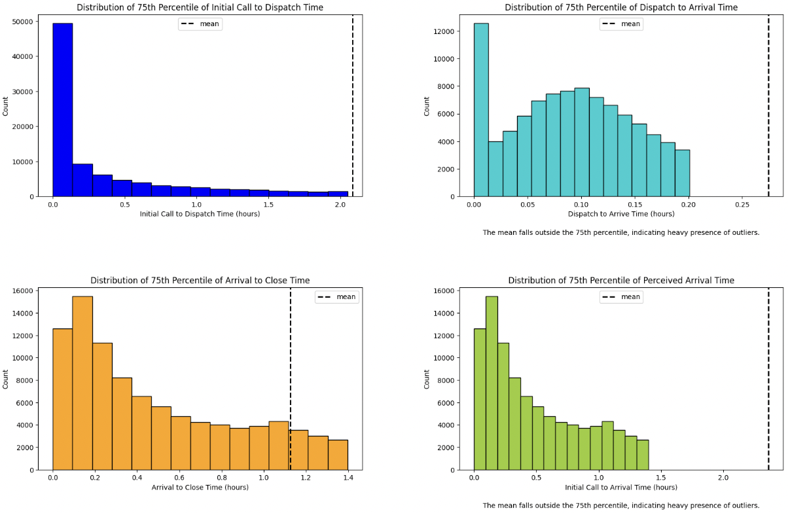
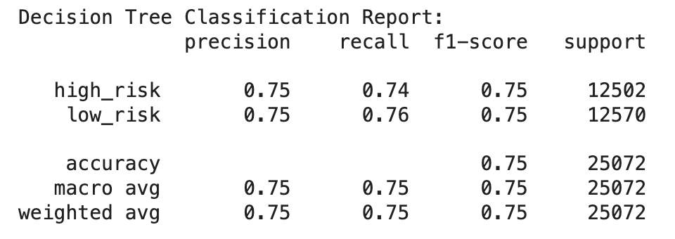
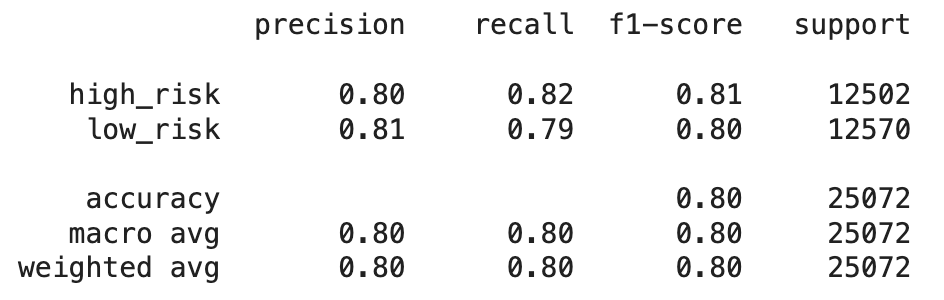
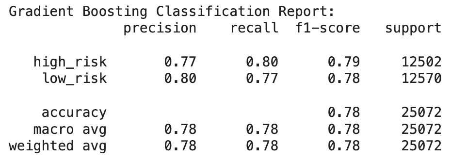
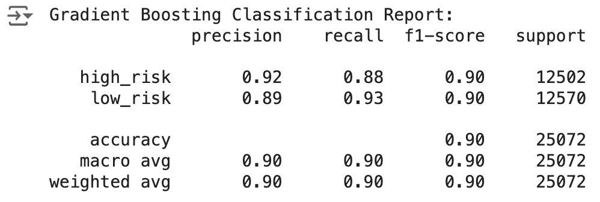

# Project Overview
This project aims to analyze and predict response times for incident calls reported to the Orleans Parish Communication District (OPCD) in 2023. The dataset, downloaded from Data.gov, contains 325,091 records and was cleaned by adding geospatial columns, handling missing values, and calculating new response time metrics. Trend and geospatial analyses can be used to identify patterns and hotspots, aiding resource planning. Feature engineering involved encoding categorical variables and transforming data for predictive modeling. A Gradient Boosting model was developed to predict response times to be flagged as either a "high risk" or "low risk" case based on incident category, zip code, police district, geolocation, and other incident details.

Future implications for this project include developing an app for visualizing trends and serving response time predictions, leveraging technologies like Flask, React, and AWS. The app will enhance public safety by optimizing resource allocation and improving decision-making for the New Orleans Police Department (NOPD).

### Data Collection: 
This dataset was downloaded from:
https://catalog.data.gov/dataset/calls-for-service-2023

Loaded into Jupyter as "Calls_for_Service_2023.csv"
81.4 MB CSV File
Shape: 325,091 rows, 21 columns

## 1. Data Cleaning: 

a. Import necessary libraries.
b. Load dataset into notebook using pandas.
c. Create Latitude/Longitude columns from 'Location' column using replace(), strip(), split().
d. Observe record categorization columns (ie. InitialTypeText), drop null values.

## 2. Data Transformation:

a. Create a new categorization column for broader analysis of response time correlation using the InitialTypeText column.
b. Drop values of InitialTypeText with < 70 records and other incident type records that can be deemed irrelevant for the purposes of this project (ie. routine tests).
c. Observe class distributions of InitialTypeText, Zip Code, Disposition Text, and Police District.
d. Data Type Checkpoint - convert columns to appropriate data types keeping feature engineering in mind.
2d.1 Convert Police District to an object, as it defines a categorical region, and is not used as an integer.
2d.2 Drop records where Lat/Long did not convert from the original "Location" column properly.
e. Create four new features that calculate response times in the format of hours (float).
2e.1 Dispatch Response Time = TimeDispatch - TimeCreate
2e.2 Scene Arrival Response Time = TimeArrive - TimeDispatch
2e.3 Time Arrive to Time Closed = TimeClosed - TimeArrive
2e.4 Time Create to Arrival Time = TimeArrive - TimeCreate
f. Tranform these date/time difference results to units of hours.

  
  

## 3. Exploratory Analysis:

*Class Distribution*: Observe class distribution by Incident Category, Zip Code, Police District, Disposition Text to observe geospatial distributions and ensure relatively balanced class distributions, as they affect model performance. 
**Response Time Analysis**: Evaluate the response times (InitialCalltoDispatchTime, DispatchToArriveTime, ArrivaltoClose, ActualResponseTime) to identify areas or times where response times are higher than average and investigate potential causes. 

  
  

## 4. Feature Engineering: 

**Final Target Variable**: Call to Dispatch Time - binary - above or below median response time (above median response time flagged as potential high wait time scenario). Define threshold for classification of target variable between low risk of above median dispatch time and high risk of being above median dispatch time.

Here, we are going to use median instead of mean, as the heavy presence of outliers pulled the mean to above an acceptable dispatch time for emergency response.

For reference, here are other major cities' mean 911 response times for 2023:

Chicago: 3.46 minutes  
Los Angeles: 5.7 minutes  
Seattle: 7 minutes  
Dallas: 8 minutes  
Miami: 8 minutes  
New York City: 9.1 minutes  
Atlanta: 9.5 minutes  
Houston: 10 minutes  
Detroit: 12 minutes  
Denver: 13 minutes  

**New Orleans:** 

#### 4a. Calculate point statistics and choose a threshold value for flagging high expected wait times.

Mean initial call to dispatch time: ~2.088 hours -> 125.29 minutes
Mean initial call to responder arrival time: ~2.363 hours -> 141.77 minutes

Median initial call to dispatch time may be a better metric for flagging unusually high dispatch times here, in hopes that it will reel in some of the outlier response cases reported in 2023. It will also ensure class balance of 50% / 50%.

Median initial call to responder arrival time: 0.355 hour -> 21.29 minutes

While still outside of the major US city average response time range, this threshold can still serve as an ideal response time for the city relative to what its citizens experienced in 2023.

#### 4b. Define a function to create a binary feature that labels instances as either "high risk," as in high wait time expected ( > 21.30 minutes), or "low risk," as in low/acceptable wait times expected.

#### 4c. Apply one-hot encoding transformations to categorical features (this will be done in a pipeline).

  
  

## 5. Pipelines, Models, and Hyperparameter Tuning:
 
**Response Time Prediction**: Develop a model to predict a binary outcome - a call that will be flagged as "high risk" for above threshold expected wait time, or "low risk" for below threshold expected wait time.

### Approach:

### 5a. Splitting the data.
Split data into train and test sets.

### 5b. **Train multiple models and evaluate their performance using appropriate metrics (e.g., Precision, Recall, F1)**

#### 5b.1 Decision Tree Classifier

Why a Decision Tree Classifier Might Be Well-Suited:

Simplicity and Interpretability:
Decision trees are straightforward and easy to interpret. Each decision node represents a feature and a decision rule that splits the data. For this dataset, which includes categorical and numerical features like Priority, Type, and TimeCreate_hour, a decision tree can capture the decision-making process that leads to a "high risk" or "low risk" dispatch time classification. Handling Mixed Data Types:

Can handle both categorical (Type, Beat, Zip) and numerical (TimeCreate_hour, InitialPriority) features: This makes them particularly suited for datasets with a variety of data types.  

No Need for Feature Scaling:  
Decision trees do not require feature scaling, which simplifies preprocessing. This is advantageous when dealing with features like time attributes (TimeCreate_hour, TimeDispatch_day), where scaling might not intuitively improve model performance.

#### 5b.2 Random Forest Classifier

Why a Random Forest Classifier Might Be Well-Suited:

Ensemble Learning for Robust Predictions:
A random forest is an ensemble of multiple decision trees, which are trained on different subsets of the data and features. This reduces the variance of the predictions, leading to more robust and accurate classifications compared to a single decision tree.

Handling Overfitting:
Random forests are less prone to overfitting than decision trees because they average the predictions from multiple trees. This is especially useful in a dataset like this, where certain features (e.g., InitialTypeText, DispositionText) might cause a single tree to overfit. Feature Importance:

Feature Importance: This can help identify the most critical factors influencing whether a dispatch time is classified as "high risk" or "low risk." Handling Missing Data and Noise:

Robust to Noise, Missing Data, and Outliers:
Random forests can handle missing data relatively well by averaging across the trees. They are also robust to noise, as individual noisy trees will have less influence on the final prediction.

#### 5b.2 Gradient Boosting Classifier

Why GBC Might Be Well-Suited:

Handling Complex Relationships:
GBCs can effectively capture complex, non-linear relationships between features and the target variable. This is important because 911 call data often involves factors that might not have a simple linear impact on dispatch time category (e.g., type of incident, location, time of day).

Robust to Noise and Outliers:
GBCs are generally robust to noisy data and outliers. This dataset, even after cleaning, has potential for data entry errors. It has also been confirmed to contain outliers as seen in the data cleaning notebook.

### 5c. **Use cross-validation for each model to assess how each generalizes to unseen data.**

### 5d. **Fine-tune hyperparameters using techniques using RandomizedSearch (to save computing power) within Colab.**

  

  

## 6. Assessing model performance:  

**6a.1 Decision Tree Classification Report**  
  
  
Since the default Decision Tree model's performance scores paled in comparison to Random Forest and Gradient Boost, hyperparameter tuning was not conducted.

**6a.2 Random Forest Classification Report**  

Hyperparameter tuning was conducted using Randomized Search and a "best model" was run with resulting hyperparamer arguments. However, this did impact Precision, Recall, and F1 scores at an impactful level when compared to the baseline model.  

**6a.3 Gradient Boosting Classification Report**  
  
 
Original classification report scores.  

  
Upon hyperparameter tuning the Gradient Boosting model, there was a significant increase in Precision, Recall, and F1 scores.  

**Precision for High Risk**: 0.92.   
This indicates that 92% of the calls flagged as high risk truly are high risk. This is critical in a 911 context because false positives (incorrectly labeling a low-risk call as high risk) could lead to unnecessary resource allocation.  

**Recall for High Risk**: 0.88.   
This shows that 88% of the actual high-risk calls are correctly identified. A higher recall means that the model is effective at capturing most of the high-risk cases, which is crucial for ensuring timely response to critical incidents.

**Precision and Recall for Low Risk**:  
The precision and recall are balanced here as well (0.89 precision, 0.93 recall). This balance ensures that low-risk calls are correctly identified, reducing the chances of underestimating the risk of a call that might actually be urgent.  

#### Future App Development

1. **Requirement Gathering**:
Define the key features and functionalities of the app.
Identify the end-users (e.g., NOPD officers, dispatchers) and their needs.

2. **Architecture Design**:
Plan the overall architecture of the app, including front-end, back-end, and database components.
Decide on the technologies and frameworks to be used (e.g., Flask/Django for back-end, React/Vue for front-end, PostgreSQL/AWS RDS for database).

3. **Front-End Development**:
Design a user-friendly interface for visualizing trends, hotspots, and response times.
Implement interactive dashboards using JavaScript libraries like D3.js or Plotly.
Ensure the UI is responsive and accessible.

4. **Back-End Development**:
Develop RESTful APIs using Flask or Django to handle data requests.
Integrate with the predictive model to serve response time predictions.
Implement authentication and authorization mechanisms to secure the app.

5. **Database Management**:
Set up and configure the database (e.g., AWS RDS).
Design the database schema to store incident data, model predictions, and user information.
Implement ETL processes to ingest and preprocess data from various sources.

6. **Integration and Testing**:
Integrate front-end and back-end components.
Perform unit testing, integration testing, and end-to-end testing to ensure the app works as expected.
Conduct load testing to ensure the app can handle high traffic and large volumes of data.

7. **Deployment**:
Deploy the app to a cloud platform like AWS or Azure.
Use containerization tools like Docker for easy deployment and scalability.
Set up CI/CD pipelines for automated testing and deployment.

8. **Monitoring and Maintenance**:
Monitor the app's performance and user activity using tools like AWS CloudWatch.
Collect feedback from users and make iterative improvements.
Regularly update the predictive model and app components to incorporate new data and features.

### Dataset Source
https://catalog.data.gov/dataset/calls-for-service-2023

